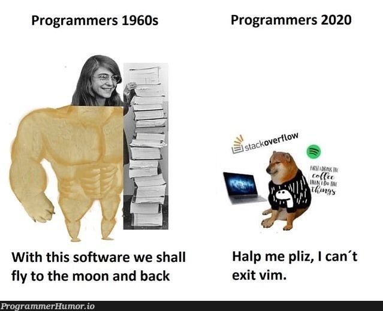

# How to be a Tarzan developer 🏕️💻

Let’s talk about optimizing our time away from our systems—because sometimes, we gotta code from the wild.

## What is it? 🤔

A **Tarzan Developer** is someone who can code from anywhere—even from a jungle, dodging wild monkeys while fixing merge conflicts.

Yeah, I just made this up. But **hear me out**—with modern tech, you can actually pull this off. Remote access, mobile development, and cloud tools have come so far that you can write code while chilling on a tree branch (hypothetically).

## Why? 🚀

Because life isn’t always fair.

I travel weekly from home to the office, and during that time, **my beloved personal PC sits at home, alone, missing me** 😢. But my work (and curiosity) got me thinking—**can I still code without it?**

Spoiler alert: Yes. And it felt amazing. For a while. Then reality hit.

## How? 🛠️

Alright, let’s break it down. **Setting up a system that lets you work from anywhere** takes just **three** simple steps:

1. Set Up Your Personal Computer 🏡💻
   1. First, make sure your **PC is accessible** remotely. I used **Tailscale** to create a **mesh network**, which basically means my PC is always just a secure tap away.
   2. **Setup SSH** (because without it, you’re just pretending to be a hacker).

2. Set Up Your Mobile Device 📱
   1. Install Tailscale on your phone. Connect it to the network, and now your **phone can talk to your PC** (hopefully in a civilized manner).
   2. Install Termux (or any SSH terminal app). Now your mobile can be your **gateway to the coding jungle.**

3. Use a Terminal-Based IDE 🧑‍💻
   1. You need a code editor that runs inside a terminal. I used **Neovim** with **LazyVim—but** that’s a rant for another day. Let’s just say, **it was an emotional rollercoaster.**

## Who is this even for? 🎯

Honestly? I thought it was for me, but it turns out… **I am NOT a Tarzan developer.** 🏴‍☠️

It was fun at first—felt like I was in Watch Dogs, hacking into systems from my phone. But after a few days, I realized...

## Is it Worth it? 🤷

✅ YES. Because it’s free. If I had to pay for it, I’d just use a proper virtual desktop like Azure Virtual Desktop (which, fun fact, I actually used, and it works great).

🚨 BUT there’s a problem:

**Tailscale does NOT auto-reconnect** once disconnected. So if my phone lost connection, I had to go back home, manually restart it, and cry a little.

## Final Thoughts 🌲

Being a **Tarzan Developer** isn’t easy. But if you love hacking on the go and don’t mind tiny screens and occasional rage quits, it’s totally worth trying.

For me? **It was a fun experiment.** But I think I’ll stick to my big-boy PC for actual work.
